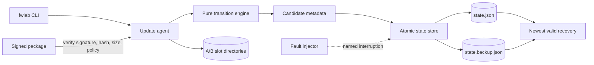

# Firmware Release & Recovery Lab

[](https://github.com/JasonStys/firmware-release-recovery-lab/actions/workflows/ci.yml)
[](https://github.com/JasonStys/firmware-release-recovery-lab/actions/workflows/security.yml)

A safe, deterministic Rust simulator for reasoning about signed A/B firmware updates,
bounded trial boots, health confirmation, rollback, and interrupted durable writes. It
operates only on local directories and synthetic byte strings: it does not flash devices,
implement secure boot, download firmware, or access hardware.

## 60-second quickstart

Prerequisites: Rust 1.90.0 (the toolchain file selects it) and Git.

```bash
cargo run -- init --root demo/device --version 1.0.0
cargo run -- package --output demo/release-2 --version 2.0.0 --release-id release-2.0.0
cargo run -- stage --root demo/device --package demo/release-2
cargo run -- activate --root demo/device --slot B --attempts 2
cargo run -- boot --root demo/device
cargo run -- confirm --root demo/device
cargo run -- status --root demo/device --json
```

Run every validation gate and a 1,200-scenario interruption campaign:

```bash
bash scripts/validate.sh
```

## Why this project exists

An update system is credible only if its failure behavior is explicit. This lab makes four
invariants executable and reviewable:

1. Unverified content is never selected for boot.
2. The last health-confirmed image remains available during an update.
3. Trial boots have a bounded attempt budget and deterministic rollback.
4. A restart after any modeled metadata-write interruption loads either the prior valid
   state or the synchronized next state.

The result is a compact portfolio project about reliability engineering, not a claim of
production bootloader or hardware-security expertise.

## Major features

| Feature | What it demonstrates |
| --- | --- |
| Signed packages | Canonical JSON metadata, SHA-256 image binding, and Ed25519 verification before staging |
| Compatibility policy | Hardware allowlist, schema version, image size, boot-attempt bounds, and monotonic version floor |
| Pure transition engine | Stage, activate, select boot, confirm health, fail health, and rollback without filesystem coupling |
| Durable state adapter | Synchronized temporary write, prior-state recovery copy, rename, validation, and newest-valid generation selection |
| Fault injection | Six named commit boundaries exercised during both stage and activation |
| Auditability | Monotonic generations and bounded causal event history persisted with each transition |
| CLI | Human-readable status plus JSON output for automation and evidence capture |
| Verification | Unit, integration, property, tamper, recovery, Clippy, rustfmt, docs, and dependency-advisory gates |

## Architecture



The transition engine owns policy; the store owns durability mechanics; the agent performs
ordered orchestration. See [architecture](docs/architecture.md), [state machine](docs/state-machine.md),
and [durable-write model](docs/durable-writes.md).

## Failure demonstration

To force automatic rollback, initialize and stage as above, activate with one attempt, then:

```bash
cargo run -- boot --root demo/device
cargo run -- fail --root demo/device --reason "watchdog deadline expired"
cargo run -- status --root demo/device --json
```

The selected slot returns to A, slot A remains confirmed, and the persisted audit entry
explains why slot B was rejected.

## Tests and evidence

`cargo test --all-targets --locked` currently covers:

- strict version parsing and invariant validation;
- image tampering, invalid signatures, and incompatible hardware;
- successful confirmation and exhausted-attempt rollback;
- primary/backup recovery at each durable metadata boundary;
- public API behavior across process-like agent restarts;
- property-generated versions and attempt budgets; and
- repeated stage/activation interruption campaigns.

GitHub Actions rebuilds the release binary, denies compiler and Clippy warnings, regenerates
the exact declaration index, audits dependencies, and uploads the campaign JSON. Local
results are recorded in [the validation report](docs/reports/validation.md); the test
strategy explains coverage and exclusions.

## Security and safety boundaries

- The repository's signing seed is intentionally public and **must never** protect a real
  release. It exists only to make examples reproducible.
- The simulator does not model a ROM root of trust, protected key storage, anti-rollback
  fuses, recovery authentication, measured boot, encrypted transport, or physical attacks.
- Package paths are provided by the operator, while internal slot and state paths are fixed
  below the selected lab root.
- No command contacts a device or network endpoint.

See [SECURITY.md](SECURITY.md), [threat model](docs/threat-model.md), and
[known limitations](docs/limitations.md) before adapting any idea to real systems.

## Repository guide

| Area | Summary |
| --- | --- |
| `src/model.rs` | Persisted types, strict versions, slot identities, audit records, and invariants |
| `src/package.rs` | Canonical manifests, package I/O, policy checks, signature/digest verification |
| `src/transition.rs` | Side-effect-free lifecycle decisions |
| `src/store.rs` | Simulated slots and recoverable metadata commits |
| `src/fault.rs` | Named one-shot interruption injection |
| `src/agent.rs` | Ordered orchestration and campaign reporting |
| `src/main.rs` | `fwlab` command definitions and output |
| `tests/` | Property and persisted end-to-end behavior |
| `scripts/` | Local/CI validation, source-header checks, and exact code indexing |
| `docs/` | Architecture, decisions, safety analysis, operations, tests, and evidence |
| `.github/` | Read-only CI/security workflows and dependency maintenance |

Every authored file is summarized in [the repository map](docs/repository-map.md), and exact
function/type locations are generated in [the code index](docs/code-index.md).

## Complexity and performance

- Version, policy, and state transition checks are `O(h)` for `h` compatible hardware IDs;
  slot access is `O(log 2)`, effectively constant.
- Hashing and package verification are `O(n)` in image bytes, which is unavoidable for full
  integrity verification.
- Recovery examines two bounded metadata files: `O(1)` file count and `O(m)` JSON bytes.
- Audit storage is capped at 128 events so state size and commit time remain bounded.

Measured campaign timing is machine-dependent and is reported as evidence, not a real-time
guarantee.

## Development

```bash
cargo fmt --all -- --check
cargo clippy --all-targets --all-features -- -D warnings
cargo test --all-targets --all-features --locked
cargo doc --no-deps --document-private-items --locked
python scripts/verify_repo.py
```

Contributions follow [CONTRIBUTING.md](CONTRIBUTING.md). Design choices are captured as ADRs,
starting with [Rust for the state engine](docs/adr/0001-rust-state-engine.md) and
[recoverable JSON metadata](docs/adr/0002-recoverable-json-metadata.md).

## License

MIT. See [LICENSE](LICENSE).

