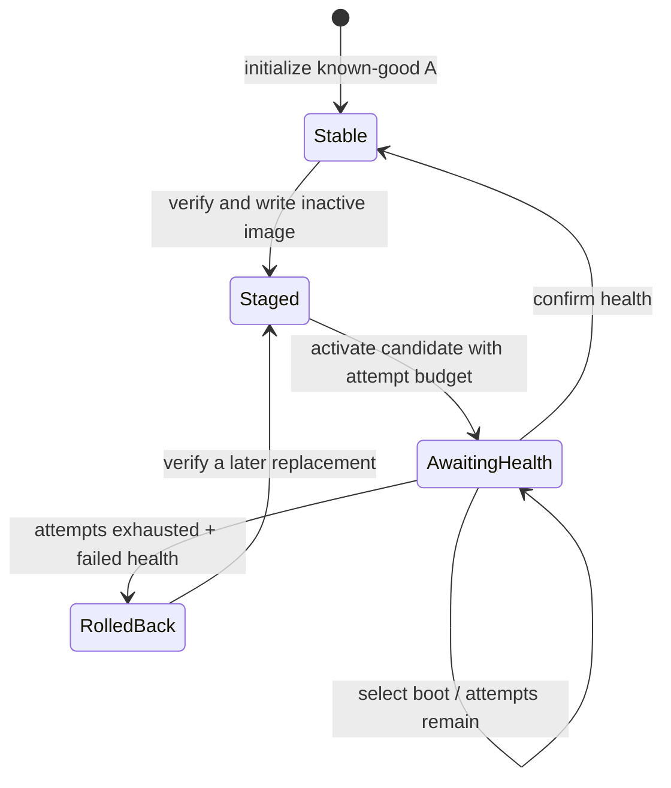

# State machine

## States and transitions

`RolledBack` is an auditable stable condition: no candidate is pending, the active and
confirmed slots match, and the rejected slot record remains available for inspection.

## Transition contract

| Operation | Preconditions | Durable result |
| --- | --- | --- |
| `stage` | No pending candidate; package already verified | Inactive slot is verified; phase is `staged` |
| `activate` | Target is inactive, present, verified; attempts 1–10 | Candidate is active/pending; phase is `awaiting_health` |
| `select_boot` | Metadata invariants hold | Decremented attempt count before candidate executes |
| `confirm_health` | Candidate is pending | Candidate becomes active and confirmed; attempts clear |
| `record_boot_failure` | Candidate is pending | Audit failure or restore confirmed image when budget is zero |

## Invariants

- `confirmed` always references a verified slot record.
- `active` always references a verified slot record.
- A missing `pending` slot implies zero remaining candidate attempts.
- A present `pending` slot implies the `awaiting_health` phase.
- Package compatibility is checked before `stage`, not after a failed boot.

These are runtime validations as well as test assertions. Recovered files that violate them
are ignored rather than trusted.

